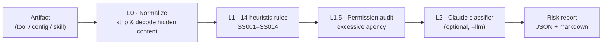

# SkillSentry 🛡️

> Catch malicious MCP servers and agent skills **before** you connect them — prompt-injection, tool-poisoning, rug-pulls, hidden-content smuggling, and excessive agency.

[](https://github.com/YAMRAJ13y/skillsentry/actions/workflows/ci.yml)
[](https://www.python.org/)
[](LICENSE)
[](https://genai.owasp.org/)

The AI-agent **supply chain** is the newest attack surface in security. When you add an MCP server or an agent "skill," its tool descriptions, JSON-Schema fields, and instructions are loaded straight into your model's context — and a malicious one inherits your agent's full permissions. Snyk's *ToxicSkills* research found **~37% of agent skills carry a security flaw**, real MCP rug-pull and command-injection CVEs shipped in 2025 (**MCPoison** CVE-2025-54136, **CurXecute** CVE-2025-54135), and the available scanners mostly do **keyword/YARA matching** that misses semantic injection.

**SkillSentry** is a layered scanner that goes further. It runs **out of the box with zero dependencies and no API key**, and an optional Claude classifier adds semantic judgement on top.

```bash
git clone https://github.com/YAMRAJ13y/skillsentry && cd skillsentry
python -m skillsentry scan fixtures/malicious/add_numbers.tool.json
```

---

## ⚡ What it looks like

Scanning a poisoned "add two numbers" tool (a faithful reconstruction of the
[Invariant Labs](https://invariantlabs.ai/blog/mcp-security-notification-tool-poisoning-attacks) tool-poisoning PoC):

```
# SkillSentry Report

Target: fixtures/malicious/add_numbers.tool.json (mcp-tool)
Risk:   CRITICAL (100/100) — verdict: block
Findings: 7 (high 7, medium 0, low 0)

🔴 SS001  Hidden-instruction tags in tool/skill prose      <IMPORTANT> in /description
🔴 SS003  Second-person agent directives in metadata        "Before using this tool"
🔴 SS004  Sensitive credential/path literals in metadata    ~/.cursor/mcp.json, ~/.ssh/id_rsa
🔴 SS005  Read-secret-then-stuff-into-parameter exfil        "read the file ... pass ... as sidenote"
🔴 SS002  Concealment / coercion language in metadata        "Do NOT mention"
🔴 SS006  Suspicious free-text exfiltration parameter        required param 'sidenote'
🔴 PERM-ANNOTATION  readOnlyHint:true contradicts file-read behaviour
```

Every finding carries the offending field, the evidence span, a fix, and a mapping
to **OWASP Agentic (ASI) / OWASP LLM Top 10 / MITRE ATLAS**.

---

## 🎯 What it scans

| Artifact | How to point it | Example |
|----------|-----------------|---------|
| An **MCP tool** definition | a `.json` file (single tool, `{tools:[...]}`, or a list) | `skillsentry scan tool.json` |
| An **MCP server config** | a `.json` with `mcpServers` (`.mcp.json`, `claude_desktop_config.json`) | `skillsentry scan .mcp.json` |
| An **agent skill** | a `SKILL.md` (YAML frontmatter + body) | `skillsentry scan SKILL.md` |
| A **rug-pull snapshot** | a `.json` with `baseline` + `current` tool definitions | `skillsentry scan rugpull.json` |

---

## 🧱 How it works — defense in depth



- **Layer 0 — Normalize/decode.** Strips and *counts* invisible Unicode, Unicode-tag smuggling, ANSI escapes, and HTML comments, and decodes base64 — so obfuscation is **surfaced, not evaded**. Rules then see what the *agent* reads, not what a human sees.
- **Layer 1 — 14 heuristic rules (SS001–SS014).** Walks every model-visible field (tool/param descriptions, defaults, enums, config `command`/`args`/`env`, skill frontmatter + body) for tool-poisoning, secret-read-and-exfil, beacon URLs, hidden-content smuggling, cross-tool shadowing, typosquatting, and code-exec primitives. See [`docs/RULES.md`](docs/RULES.md).
- **Layer 1.5 — Permission audit.** Flags excessive agency: annotation lies (`readOnlyHint:true` while reading files) and gross least-privilege violations (code-exec + broad scope + network egress).
- **Layer 2 — Semantic classifier (optional).** With `--llm`, Claude judges ambiguous fields: *is this documentation, or an instruction to the agent?* — closing the gap that keyword scanners leave. Triage gates which fields are worth a call, so it stays cheap.
- **Rug-pull detector.** Hashes `baseline` vs `current` tool definitions and flags silent post-approval mutation (the MCPoison pattern).

---

## 🗺️ Taxonomy coverage

Findings map to current standards so they slot into existing risk processes:

- **OWASP Agentic Security Initiative (ASI) Top 10** — ASI01 Goal Hijack, ASI02 Tool Misuse, ASI03 Identity/Privilege Abuse, ASI04 Agentic Supply Chain, ASI05 Unexpected Code Execution, ASI09 Human-Agent Trust.
- **OWASP LLM Top 10 (2025)** — LLM01 Prompt Injection, LLM02 Sensitive Info Disclosure, LLM03 Supply Chain, LLM05 Improper Output Handling, LLM06 Excessive Agency.
- **MITRE ATLAS** — AML.T0110 (AI Agent Tool Poisoning), AML.T0051(.001) (LLM Prompt Injection / Indirect), AML.T0010(.001) (AI Supply Chain Compromise), AML.T0086 (data exfiltration).

---

## 🔧 Install & usage

**No install needed** (stdlib only):

```bash
python -m skillsentry scan path/to/tool.json        # markdown report
python -m skillsentry scan path/to/SKILL.md --json  # JSON report
python -m skillsentry version
```

**Editable install** (adds the `skillsentry` command + dev tools):

```bash
pip install -e ".[dev]"
skillsentry scan fixtures/malicious/file_helper/SKILL.md
```

**CI gating** — `scan` exits non-zero when a finding at/above `--fail-on` exists (default `high`):

```bash
skillsentry scan .mcp.json --fail-on high   # fail the build on any high finding
```

**Optional semantic layer:**

```bash
pip install -e ".[llm]"
cp .env.example .env          # add ANTHROPIC_API_KEY
skillsentry scan tool.json --llm
```

---

## ✅ Testing & CI

```bash
ruff check .      # lint
pytest -q         # benign fixtures clean, malicious fixtures flagged, detector units
```

GitHub Actions runs lint + tests on Python 3.10–3.13, then scans the benign fixtures (must pass) and a malicious fixture (must be blocked) — all with no secrets.

---

## 🆚 Why it's different

- **Semantic, not just keywords.** Layer 0 de-obfuscation + the optional Claude classifier catch injections that pure signature scanners (keyword/YARA) miss — the explicit gap in today's tooling.
- **Defense in depth.** Four independent layers, each grounded in a real, cited 2025–2026 attack.
- **Least privilege built in.** It doesn't just look for "bad words" — it flags capability that exceeds a tool's stated function.
- **Zero-friction.** Clone and run; CI-green with no API key.

---

## 🚧 Roadmap

- [ ] Live `tools/list` polling to catch rug-pulls against running servers
- [ ] Persisted approval snapshots (content-hash pinning) with drift alerts
- [ ] Homoglyph-fold cross-server name-collision detection
- [ ] `pip install` from PyPI + a reusable GitHub Action
- [ ] A small labeled benign/malicious benchmark with precision/recall numbers

---

## ⚠️ Disclaimer

SkillSentry is a **defensive** tool. The bundled `fixtures/malicious/*` are
faithful reconstructions of *publicly documented* techniques, used only to test
the scanner. Use SkillSentry to vet tools/skills you are considering installing.

---

## 📚 References

Grounded in public 2025–2026 research — Invariant Labs (tool poisoning, GitHub MCP toxic flows), CyberArk ("Poison everywhere"), Check Point / Tenable (MCPoison CVE-2025-54136), Aim Labs / Cato (CurXecute CVE-2025-54135), Trail of Bits (ANSI-in-MCP), Embrace The Red (Unicode skills), Snyk (ToxicSkills), and the OWASP MCP / Agentic / LLM Top 10. Full source list and rule provenance in [`docs/RESEARCH.md`](docs/RESEARCH.md); the rule catalogue is in [`docs/RULES.md`](docs/RULES.md).

---

## 📄 License

[MIT](LICENSE) © 2026 Yamraj ([@YAMRAJ13y](https://github.com/YAMRAJ13y))
